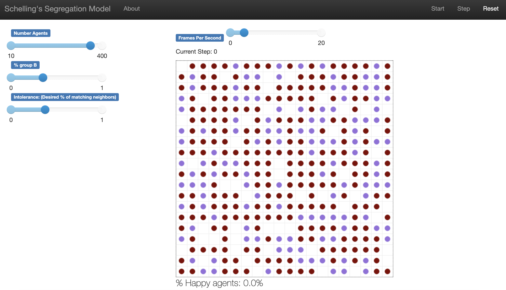
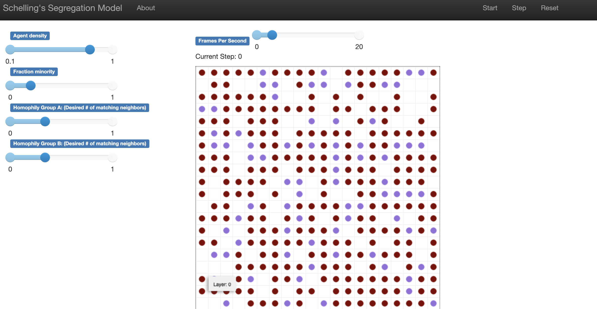
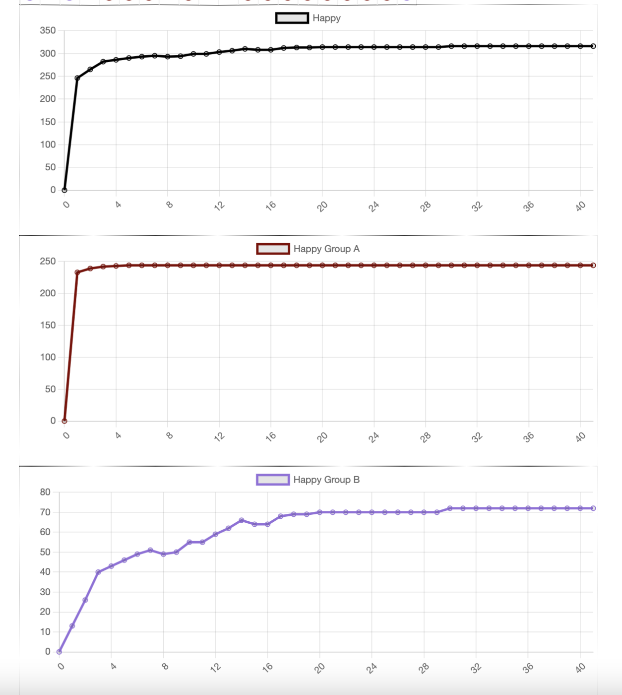

```{r setup, include=FALSE}
knitr::opts_chunk$set(echo = FALSE)
```

<style>
div.footnotes {
  position: absolute;
  bottom: 0;
  margin-bottom: 10px;
  width: 80%;
  font-size: 0.6em;
}
</style>

<script src="https://ajax.googleapis.com/ajax/libs/jquery/3.1.1/jquery.min.js"></script>
<script>
$(document).ready(function() {
  $('slide:not(.backdrop):not(.title-slide)').append('<div class=\"footnotes\">');

  $('footnote').each(function(index) {
    var text  = $(this).html();
    var fnNum = (index+1).toString();
    $(this).html(fnNum.sup());

    var footnote   = fnNum + '. ' + text + '<br/>';
    var oldContent = $(this).parents('slide').children('div.footnotes').html();
    var newContent = oldContent + footnote;
    $(this).parents('slide').children('div.footnotes').html(newContent);
  });
});
</script>

## Intro & Agenda {data-background=#e6e3e3}
Today we'll cover the foundations of getting started in modeling, giving an overview of models, their uses and applications, and how they might feature into a course. 

> - Talk Context
> - Intro to Agent-Based Models
> - Model Components
> - Application (Schelling)
> - Adapting Models / Varying Parameters
> - Course Framing
> - Conclusions

 
## What is an Agent-Based Model (ABM)?
ABMs allow you to focus on a) the evolution of behavior / system and b) explicitly engage with heterogeneous actors. 

> - In contrast to other types of models, ABMs permit heterogenous agents who can have different experiences and allow you to explore system-level effects and the path to equilibrium. 

## ABMs vs. other models:
Here are a couple other model types you might be exploring and how they compare:

- **Linear Regression**: focus upon large-scale relationships instead of individual-level factors (variables are a means to an end and we look at change `on average.'

-- **Systems Dynamics**: focus on the system from a high level; typically want an understanding of the equations governing the system. 

--**Game Theory**: can look at final equilibrium of the system, but you don't get information about what occurs on the way there/what that journey is like nor how long it will take. 

--**ABM**: `Bottom-up' approach that allows you to begin with simple assumptions and analyze how the system behaves and emergent phenomena to result from the model. 

## ABM Setup & Components: Who does what, how? {.build}
- **Actors** (what are the units / agents /actors)
    - Initialize them with identical or varied attributes
- **Parameters** (AKA *variables*) (what are the possible values/items that can be incorporated)
    - Consider range and other variation / combination potentials
- **Framework**  structure for interaction (in what way are actors aggregating information from their environment)
    - Structure ecosystem / environment for agent
    - Set up movement / behavior (where are they placed, how do they interact, how do they move, etc.) 
    

## Applications
One key value of ABMs is that you can evaluate system dynamics from relatively simple initial conditions. For example, you can look into exploring how different actor preferences or attributes can contribute to and produce large-scale effects and equilibria. 

- **Political Science** emergence of markets, effects of institutional change 
- **Sociology** neighborhood segregation, evolution of cultural groups
- **Economics** tragedy of the commons, market bubbles
- **Ecology** flocking, predator/prey models, ecosystems
- **Epidemiology** pandemic modeling, health disparities, public health policy analysis


## Example: Schelling's Segregation Model
Today, we're going to go over a classic model that is intuitive to understand, somewhat surprising in its findings, and easily customizable: Schelling's segregation model.<footnote>Schelling, T. C. (1978). *Micromotives and macrobehavior.* New York: Norton.</footnote>

>- The model seeks to explore how when focusing *solely* on actor behavior / motivation between two groups, and assuming somewhat benign intentions (no explicit dislike / hatred), we might still see somewhat stark segregation. 

>- Schelling's model is one piece in exploring and understanding patterns we see in housing markets and neighborhood patterns. 

## Example: Schelling's Segregation Model, ABM setup {.smaller}
> - **Actors** (what are the units / agents /actors) 
     + <span style="color:darkblue">Need two types of actors (why two?) </span> 


> - **Parameters** (AKA *variables*) (what are the possible values/items that can be incorporated)
      + <span style="color:darkblue"> Need them to have some type. </span>  
      + <span style="color:darkblue"> Need them to have some threshold of tolerance. </span> 

> - **Framework**  structure for interaction (in what way are actors aggregating information from their environment)
    * <span style="color:darkblue"> Start with random placement. </span>
    * <span style="color:darkblue"> Need a neighborhood / area to scan. </span>
    * <span style="color:darkblue"> Need to be able to evaluate their satisfaction.</span>
    * <span style="color:darkblue"> Need to be able to move somewhere if unsatisfied. </span>

## Schelling's Model: preview
{width=95%}


## Schelling's Model: setting up an ABM in PyCharm & Best practices
I chose PyCharm for this, but you could do it in a Jupityr notebook, Google Collab, or your IDE of choice. 

>- Framework for running the ABM: Mesa https://pypi.org/project/Mesa/  <footnote>Documentation here: https://mesa.readthedocs.io/_/downloads/en/latest/pdf/ </footnote>
>- File structure: start with three files
  >- Model (where you'll actualize agents and their environment)
  >- Server (where you'll visualize the model)
  >- Run (where you run the model<footnote>(not always necessary for simple models but good to build the habit now!)</footnote>)
  >- README file with an overview of your model

## Designing the model: structure of the model file {.smaller}
In the interest of time, we'll focus on the model file. We'll need to think about our agents, what they can do, and how. You'll have two main classes: agent and the model. 

>- (Import Mesa and anything else you'll need)
> - **Agent class**: 
  - initialize properties within the agents (e.g. happiness)
  - define what happens for an agent within a time step
  
> - **Model class**:  
  - define model-level parameter values (e.g. desired similarity level)
  - define what happens at the model level in a time step (e.g. run the model until all agents are happy)
  - collect data

--- 
ENOUGH TALKING, LET'S SEE IT!
---

# All models are wrong, but some are useful.
- George Box

## Complicating the model
We might think that while simple, we've sacrificed *too much* and we want to recapture some of the complexity of the situation. Let's consider ways we might complicate this model in a meaningful way: 

+ Types of agents (could consider multiple types).
+ Sensitivity of agents (some are more/less tolerant).
+ Initialization of the model (could think about `geographic' placement of actors/agents).
+ Additional attributes of actors (e.g. wealth).

## Complicating the model: Agent sensitivity / tolerance {.smaller}
There are many ways we could think about agent sensitivity / tolerance: The big focus might be across or within group tolerance. 

**Across group tolerance** Here, our concern is whether the two groups have similar levels of tolerance. We might vary the tolerance for each group, either through setting finite different levels or making some kind of different adjustment (e.g. drawing from a distribution). 

**Within group tolerance** Here, our concern is whether the agents within each group have the same tolerance threshold. We might set two levels of tolerance (low/high) either through a slider, or through a function of one to the other. We might also draw tolerance from some kind of distribution. 

**Our motto is always KEEP IT SIMPLE**

## Schelling with two levels of tolerance
Here, we'll dive back in and observe what happens when we have two levels of tolerance, one per group, than can potentially vary. Consider what you think will happen and make a prediction -- in particular, think about how the other parameter values (proportion of group size, density) may also factor in. 

{width=95%}


## Output/Analysis: in and out of the model
When you run the model, you can also include charts and other graphics to track relevant metrics. 

{width=45%}

## Output/Analysis: in and out of the model
When you run the model, you can also include charts and other graphics to track relevant metrics. But, you may want to be able to do things with this data beyond looking at it on a model-by-model-run basis. 

There are options to 
a) export your data and 
b) to do multiple runs of your model to explore trends. (Why would we want to run a model more than once?)

## Applications & Connections to Research


## Course Framing
This was an excerpt and condensation of a course on ABM. Below I provide a loose outline for what we would cover. 

**Course topics**
- Intro / Background
- Applications / Canonical Models
- Diagnostics
- Output / Model Analysis
- Robustness checks
- Getting it 'Right' --  The Art of Modeling


# Questions? Thank you!


