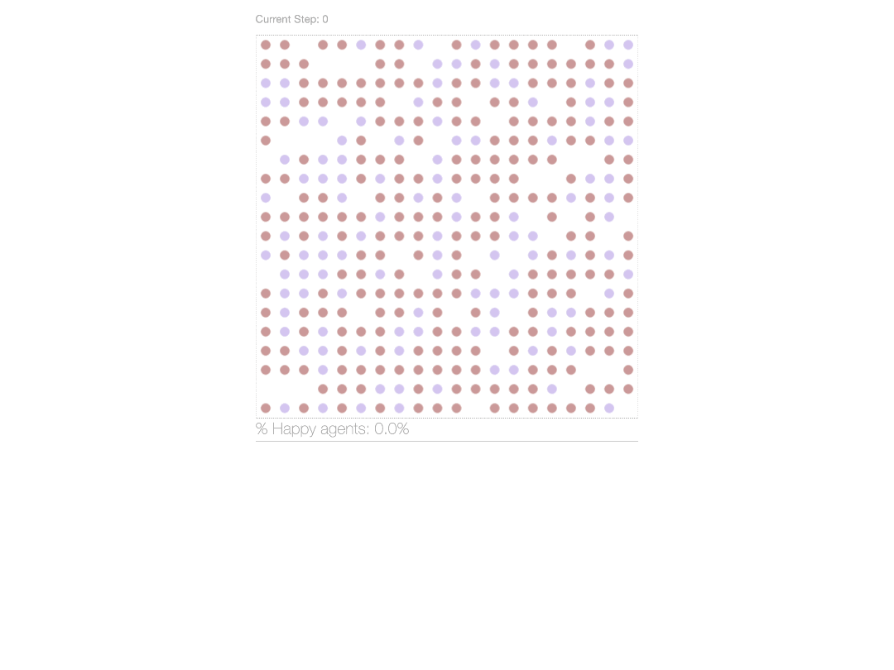

class: title-slide, left, bottom
background-image: url(images/model_example.gif)
background-size: cover

#**Getting Started with Agent-Based Models** 
###Jean Clipperton
### `r Sys.Date()`
---
class: inverse, middle
# Goals for today:
1. Learn setup for Agent-Based Modeling
2. Explore a classic ABM model 

--
3. Have fun (!)


```{r setup, include=FALSE}
knitr::opts_chunk$set(echo = FALSE)
```

```{r xaringanExtra, echo=FALSE}
xaringanExtra::use_panelset()
xaringanExtra::use_freezeframe()
xaringanExtra::use_banner(
  #top_left = "",
  #top_right = " ",
  bottom_left = "Slides & Code: https://github.com/jmclip/ABM",
  exclude = "title-slide"
)
```


---
# Intro & Agenda  
Today we'll cover the foundations of getting started in modeling, giving an overview of models, their uses and applications, and how they might feature into a course. 

--
 - Talk Context
 - Intro to Agent-Based Models
 - Model Components
 - Application (Schelling)
 - Adapting Models / Varying Parameters
 - Course Framing
 - Conclusions

---

# What is an Agent-Based Model (ABM)?
ABMs allow you to focus on a) the evolution of behavior / system and b) explicitly engage with heterogeneous actors. 

--

In contrast to other types of models, **ABMs permit heterogeneous agents who can have different experiences** and allow you to explore system-level effects, the path to equilibrium, and **emergent phenomena.** 
 
---

# ABMs vs. other models:
Here are a couple other model types you might be exploring and how they compare:

- **Linear Regression**: focus upon large-scale relationships instead of individual-level factors (variables are a means to an end and we look at change 'on average'.

- **Systems Dynamics**: focus on the system from a high level; typically want an understanding of the equations governing the system. 

- **Game Theory**: can look at final equilibrium of the system, but you don't get information about what occurs on the way there/what that journey is like nor how long it will take. 

- **ABM**: 'Bottom-up' approach that allows you to begin with simple assumptions and analyze how the system behaves and emergent phenomena to result from the model.  


---

# ABM Setup and Components: 
##Who does what, how?
- **Actors** (what are the units / agents /actors)
  - Initialize them with identical or varied attributes
- **Parameters** (AKA *variables*) (what are the possible values/items that can be incorporated)
  - Consider range and other variation / combination potentials
- **Framework**  structure for interaction (in what way are actors aggregating information from their environment)
  -Structure ecosystem / environment for agent
  - Set up movement / behavior (where are they placed, how do they interact, how do they move, etc.) 
    
    
    
---
# Applications
One key value of ABMs is that you can evaluate system dynamics from relatively simple initial conditions. For example, you can look into exploring how different actor preferences or attributes can contribute to and produce large-scale effects and equilibria. 

- **Political Science** emergence of markets, effects of institutional change 
- **Sociology** neighborhood segregation, evolution of cultural groups
- **Economics** tragedy of the commons, market bubbles
- **Ecology** flocking, predator/prey models, ecosystems
- **Epidemiology** pandemic modeling, health disparities, public health policy analysis


---
# Example: Schelling's Segregation Model
Today, we're going to go over a classic model that is intuitive to understand, somewhat surprising in its findings, and easily customizable: Schelling's segregation model. 

.footnote[Schelling, T. C. (1978). *Micromotives and macrobehavior.* New York: Norton.]


- The model seeks to explore how when focusing *solely* on actor behavior / motivation between two groups, and assuming somewhat benign intentions (no explicit dislike / hatred), we might still see somewhat stark segregation. 

- Schelling's model is one piece in exploring and understanding patterns we see in housing markets and neighborhood patterns. 

---
# Example: ABM setup  
 - **Actors** (what are the units / agents /actors) 
     + <span style="color:darkblue">Need two types of actors (why two?) </span> 


 - **Parameters** (AKA *variables*) (what are the possible values/items that can be incorporated)
      + <span style="color:darkblue"> Need them to have some type. </span>  
      + <span style="color:darkblue"> Need them to have some threshold of tolerance. </span> 

 - **Framework**  structure for interaction (in what way are actors aggregating information from their environment)
    * <span style="color:darkblue"> Start with random placement. </span>
    * <span style="color:darkblue"> Need a neighborhood / area to scan. </span>
    * <span style="color:darkblue"> Need to be able to evaluate their satisfaction.</span>
    * <span style="color:darkblue"> Need to be able to move somewhere if unsatisfied. </span>

---
# Schelling's Model: preview

```{r, out.width= "60%", fig.align="center", fig.cap="Where we're going"}

```
---
# Schelling's Model: 
## Setting up an ABM in PyCharm & Best practices
I chose PyCharm for this, but you could do it in a Jupityr notebook, Google Collab, or your IDE of choice. 

- **Framework** for running the ABM: Mesa https://pypi.org/project/Mesa/ 
    - Documentation here: https://mesa.readthedocs.io/_/downloads/en/latest/pdf/  
- **File structure**: start with three files
  - *Model* (where you'll actualize agents and their environment)
  - *Server* (where you'll visualize the model)
  - *Run* (where you run the model(not always necessary for simple models but good to build the habit now!) ^[There are multiple ways we'll complicate this later today.]
  - *README* file with an overview of your model

---
# Designing the model: 
## Structure of the model file 
In the interest of time, we'll focus on the model file. We'll need to think about our agents, what they can do, and how. You'll have two main classes: agent and the model. 

- (Import Mesa and anything else you'll need)
- **Agent class**: 
  - initialize properties within the agents (e.g. happiness)
  - define what happens for an agent within a time step
- **Model class**:  
  - define model-level parameter values (e.g. desired similarity level)
  - define what happens at the model level in a time step (e.g. run the model until all agents are happy)
  - collect data


---
class: inverse, middle

 .Large[#**All models are wrong, but some are useful.**]
 .center[.large[*George Box*]]

---
# Complicating the model
We might think that while simple, we've sacrificed *too much* and we want to recapture some of the complexity of the situation. Let's consider ways we might complicate this model in a meaningful way: 
--

+ Types of agents (could consider multiple types).
+ Sensitivity of agents (some are more/less tolerant).
+ Initialization of the model (could think about 'geographic' placement of actors/agents).
+ Additional attributes of actors (e.g. wealth).

---
# Complicating the model: 
## Agent sensitivity / tolerance  
There are many ways we could think about agent sensitivity / tolerance: The big focus might be across or within group tolerance. 

**Across group tolerance** Here, our concern is whether the two groups have similar levels of tolerance. We might vary the tolerance for each group, either through setting finite different levels or making some kind of different adjustment (e.g. drawing from a distribution). 

**Within group tolerance** Here, our concern is whether the agents within each group have the same tolerance threshold. We might set two levels of tolerance (low/high) either through a slider, or through a function of one to the other. We might also draw tolerance from some kind of distribution. 
--

##**Our motto is always KEEP IT SIMPLE**

---
# Schelling with two levels of tolerance
Here, we'll dive back in and observe what happens when we have two levels of tolerance, one per group, than can potentially vary. Consider what you think will happen and make a prediction -- in particular, think about how the other parameter values (proportion of group size, density) may also factor in. 


```{r, out.width= "60%", fig.align="center", fig.cap="Our new model"}
knitr::include_graphics("images/schell2.png")
```

---
# Output/Analysis: in and out of the model
When you run the model, you can also include charts and other graphics to track relevant metrics. 


```{r, out.width= "40%", fig.align="center"}
knitr::include_graphics("images/schell2c.png")
```

---
# Output/Analysis
When you run the model, you can also include charts and other graphics to track relevant metrics. But, you may want to be able to do things with this data beyond looking at it on a model-by-model-run basis. 

There are options to 
- export your data   

and   

- to do multiple runs of your model to explore trends. 

*(Why would we want to run a model more than once?)*

---
# Exploring your output beyond the GUI
You might want nicer graphics from one or multiple runs. In these cases, you'll want to export your data. There are multiple ways you might do this -- I added separate files to allow you to 

1. export the data from the specific run in the gui, 
2. bypass the gui and just do a single run, 
3. do a batch run where you run the model multiple times and to get a sense of trends, 
or 
4. do a parameter sweep where you explore how varying the parameters may lead to different outcomes

---
# Single Run: exporting your data and running your own analysis
If you choose, you can export your data as a pandas Data Frame to analyze on your own. 

.panelset[

.panel[.panel-name[GUI]
For example, here are the graphics we're generally tied to in the GUI:


```{r , out.width= "30%", fig.align="center", fig.cap="Run with seed set to 10"}
knitr::include_graphics("images/schell2_seed10.png")
```
]

.panel[.panel-name[Exported & Plotted:Overall]
```{r out.width= "40%", fig.align="center" }
library(ggplot2)
seg_gui <- read.csv("~/Library/CloudStorage/OneDrive-NorthwesternUniversity/ABM/schell2/data/seg_model_gui_run_data.csv")

ggplot(seg_gui, aes(X, Happy )) +
  geom_line(color="black", size=2)+
  scale_x_continuous("Model Time Step", breaks=seq(0, 110, 25))+
  scale_y_continuous("Number of Happy Agents", breaks=seq(0, 400, 50)) +
  labs(title="Happiness over model run",
       caption="110 time steps with seed 10") +
  theme_bw() +
  theme(text = element_text(size = 20))   

```
]

.panel[.panel-name[Exported & Plotted:Groups]
```{r out.width= "40%", fig.align="center" }
library(ggplot2)
seg_gui <- read.csv("~/Library/CloudStorage/OneDrive-NorthwesternUniversity/ABM/schell2/data/seg_model_gui_run_data.csv")

ggplot(seg_gui) +
  geom_line(aes(X, y=Happy.Group.A, color="Group A"), size = 2) +
  geom_line(aes(X, y=Happy.Group.B, color="Group B"), size = 2) +
  scale_x_continuous("Model Time Step", breaks=seq(0, 110, 25)) +
  scale_y_continuous("Number of Happy Agents", breaks=seq(0, 400, 50)) +
  labs(title="Happiness over model run", 
       subtitle= "by agent group",
       caption="110 time steps with seed 10") +
  scale_color_manual(name = "Agent Groups", 
                     values = c("Group A" = "darkred", 
                                "Group B" = "mediumpurple")) +
  theme_bw() +
  theme(legend.position="bottom", 
        text = element_text(size = 20),
        plot.subtitle=element_text(size=16, face="italic", color="grey40")) 
```
]
]


---
# Applications & Connections to Research
##What could we learn from such a simple model? 

One application can be thinking about gentrification, for example in how we see neighborhoods changing over time. **Schelling's model helps us understand that having a low threshold for similar neighbors can produce staggering levels of segregation,** without even accounting for institutional structures that can entrench housing / employment practices or otherwise amplify and perpetuate differences across groups. 

What we found in our initial simulations is that about 1/3 tends to be a cutoff or threshold for seeing segregation in neighborhoods. **In established neighborhoods, would this threshold also drive change?**

--

Hwang and Sampson (2014) found that there is **indeed a 'threshold cutoff' for gentrification that appears to be around 40%.** Comparing that to the simple Schelling segregation model, 40% is just over 3/8 neighbors being from a different group. [Hwang and Sampson (2014).](https://journals.sagepub.com/doi/10.1177/0003122414535774)]


---
# Applications: Housing & Gentrification 


Schelling's model can help us understand what we observe around us, and help us further explore implications for neighborhood change. Future complications and explorations of Schelling's model might explore how to incorporate the delay and cost into moving grids to better anticipate how, for example, Minneapolis' planned 2040 ban on single-family zoning. 

```{r, out.width= "60%", fig.align="center", fig.cap="MN zoning and racial covenants"}

```

.footnote[[NPR on MN's housing ban(https://www.npr.org/2020/06/18/877460056/minneapolis-has-a-bold-plan-to-tackle-racial-inequity-now-it-has-to-follow-throu)]


---
# Recap

- ABMs offer flexibility to explore individually-focused setups
- ABMs are structured around:
  - agents
  - models
- Data can be collected on a run-by-run basis 


---
# Course Framing
This was an excerpt and condensation of a course on ABM. Below I provide a loose outline for what we would cover. 

**Course topics**
- Intro / Background
- Applications / Canonical Models
- Diagnostics
- Output / Model Analysis
- Robustness checks
- Getting it 'Right' --  The Art of Modeling


---
class: inverse, middle

#*Questions?*
 Thank you!

---
# Setting a seed
A seed is effectively a starting point for a random number generator (since they're not truly random!).

We don't go into it much here, but setting a seed allows for reproducible results. Here, I set an arbitrary seed so that if you run the model, you could replicate my results. If we were using this model for analyses, we'd record the seeds from our runs but wouldn't necessarily proscribe one. 


